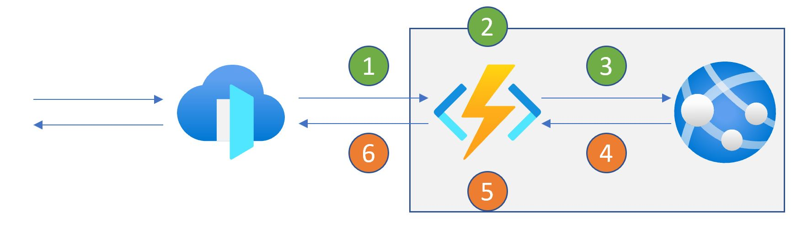
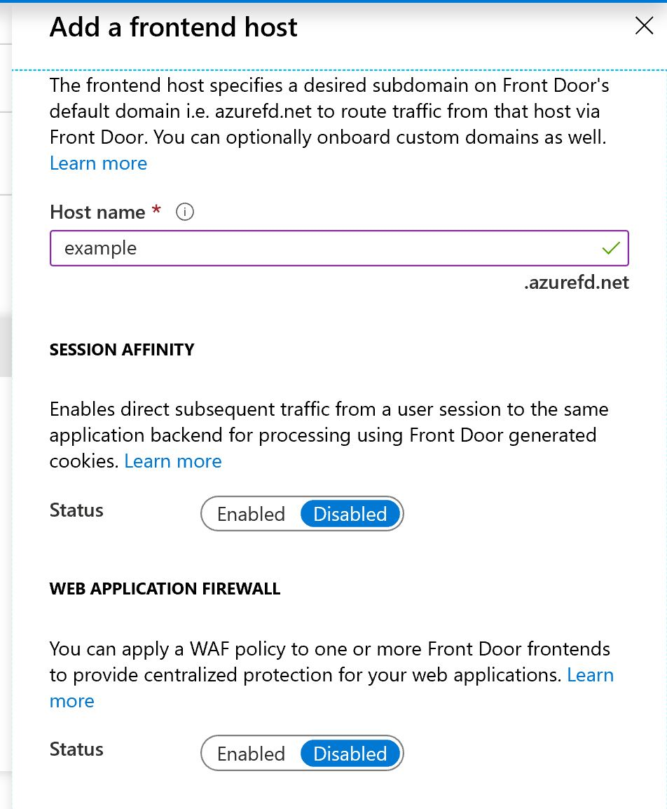
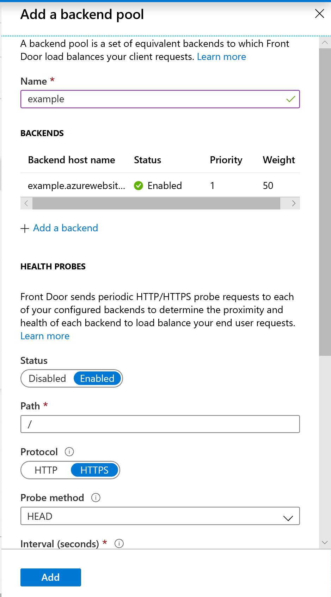
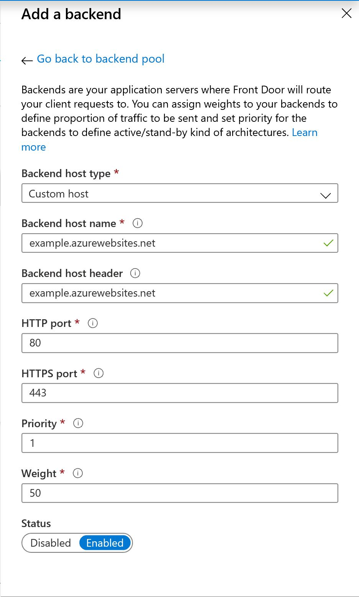
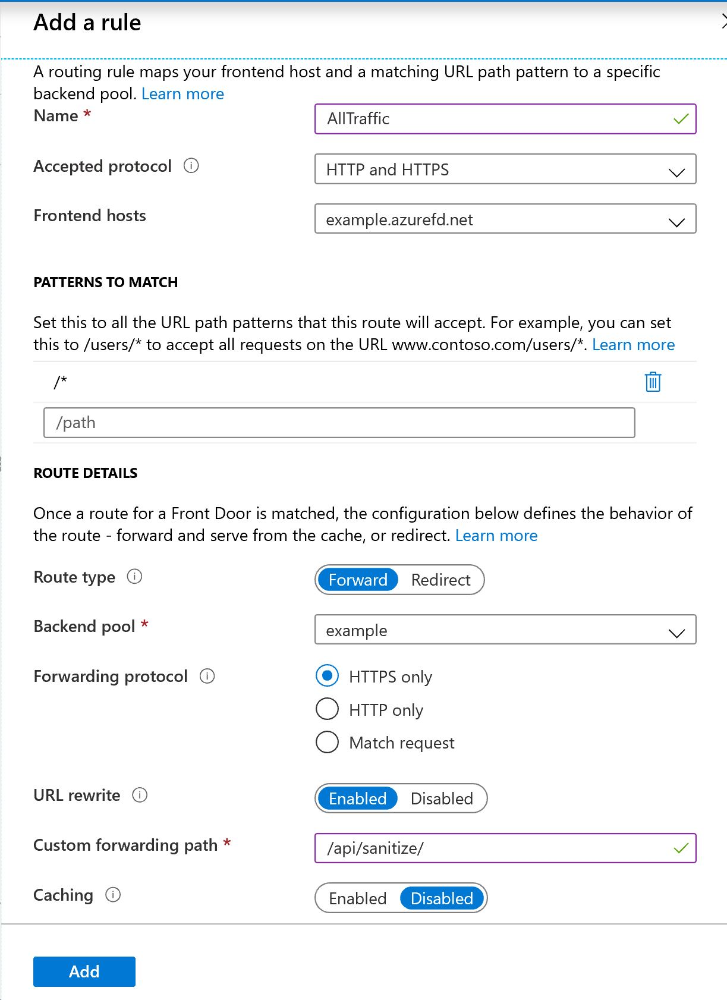

# _How-to guide_: Create a Front Door that uses an Azure Function to modify messages

There are scenarios where the traffic that is delivered via Azure Front Door must be inspected or modified as part of this process. For some scenarios, Front Door could provide that functionality via configuration:
 
- [URL rewrites](https://docs.microsoft.com/en-us/azure/frontdoor/front-door-url-rewrite) of incoming requests to map them to backend systems / routes. 
- [Adding predefined HTTP headers](https://docs.microsoft.com/en-us/azure/frontdoor/front-door-http-headers-protocol) to all incoming requests
- [Web Application Firewall Policy](https://docs.microsoft.com/en-us/azure/web-application-firewall/afds/afds-overview) to inspect and allow / block / log specific messages.

In other scenarios, this functionality is insufficient. For example, there are customers that have existing web applications and need to modify the HTTP response body to remove any references to internal URLs / systems.  

##  Overview
In this guide, we'll demonstrate how an Function App can be used to modify the contents of an HTTP response message. This is achieved by using an Function App as a facade for the existing web application (illustrated as a Web App, but this can be any type of web server / application): 



In this flow:

1. Front Door receives the HTTP request and routes this to the Function App
2. Function App to perform any processing on the HTTP request
3. Function App to forward the HTTP request to the existing web application
4. Web Application to process the HTTP request and return a HTTP response
5. Function App to perform any processing on the HTTP response
6. Function App to return the HTTP request via Front Door

## Create an Function App that acts as a Facade
In this guide, we will use the Function App to forward the incoming HTTP request as-is, but to sanitize the body of the HTTP response message. 

This is achieved via the following implementation: 

```C#
[FunctionName("Sanitize")]
public static async Task<HttpResponseMessage> Run(
    [HttpTrigger(AuthorizationLevel.Anonymous, "get", "post", Route = "Sanitize/{**path}")] HttpRequest receivedRequest,
    ILogger log, string path)
{
    HttpRequestMessage forwardedRequest = new HttpRequestMessage(
        new HttpMethod(receivedRequest.Method), 
        $"{receivedRequest.Scheme}://{TARGET_URI}/{path}?{receivedRequest.QueryString}"
    );

    receivedRequest.CopyTo(forwardedRequest);

    HttpResponseMessage receivedResponse = await _httpClient.SendAsync(forwardedRequest);

    await SanitizeHttpResponse(receivedResponse, 
        $"{FUNCTION_BASE_URI}", 
        receivedResponse.Content.Headers.ContentType);

    return receivedResponse;
}


private static async Task SanitizeHttpResponse(HttpResponseMessage result, string targetUrl, System.Net.Http.Headers.MediaTypeHeaderValue contentType)
{
    // exclude binary / other non-readable formats, like images. 
    if (contentType.MediaType.StartsWith("text", StringComparison.OrdinalIgnoreCase) // text/html, text/plain, text/javascript, text/css
        || contentType.MediaType.StartsWith("application/json", StringComparison.OrdinalIgnoreCase)) // application/json.
    {
        string content = await result.Content.ReadAsStringAsync();

        result.Content = new StringContent(content.Replace(TARGET_URI, targetUrl), System.Text.Encoding.UTF8, contentType.MediaType);
    }
}
``` 

To create a new HttpRequestMessage, an extension method (CopyTo) is created: 

```C#
public static void CopyTo(this HttpRequest source, HttpRequestMessage destination)
{
    // Copy unrestricted headers (including cookies, if any)
    foreach (string headerKey in source.Headers.Keys)
    {
        switch (headerKey)
        {
            case "Connection":
            case "Content-Length":
            case "Date":
            case "Expect":
            case "Host":
            case "If-Modified-Since":
            case "Range":
            case "Transfer-Encoding":
            case "Proxy-Connection":
                break;

            case "Accept":
            case "AcceptEncoding":
            case "User-Agent":
                // Restricted
                break;

            default:
                destination.Headers.Add(headerKey, source.Headers[headerKey].ToString());
                break;
        }
    }

    destination.Headers.Accept.ParseAdd(source.Headers["Accept"].ToString());
            
    // Copy content (if content body is allowed)
    if (source.Method != "GET"
        && source.Method != "HEAD"
        && source.ContentLength > 0)
    {
        destination.Content = new StreamContent(source.Body);
    }
}
```

Once created locally, deploy the Function App to Azure.


**Remarks**

In this sample, the Function App must know the hostname used by Front Door. This value is used to replace existing references to the internal URLs in the response body. This value is provided by Front Door via the HTTP request headers. 

## Create a Front Door that invokes the Function App
The next step in this process, is to configure Front Door hosts, backend pools and routing.

### Configure Host
For this guide, only a hostname will be configured. In production scenarios, also consider caching and web application firewall requirements. 


### Configure Backend Pools
Create a backend pool, and configure appropriate health probing / failover timings. For this guide, the default values are appropriate.


Add a backend, by configuring the Function App as the backend pool. 

This can be done conveniently as an App Service, or manually:  


### Configure Routing Rules
As a final step, configure routing. The required routing is fairly straightforward as the Function App needs to forward all requests to the web application: 



## Alternative solutions
In this how-to, Azure Functions are used to perform the required modification. There are alternative options available, such as API management or a custom IIS module. 

### IIS Module
An IIS module is installed on the web server directly. It is part of the processing pipeline of IIS and does not require any changes to the application. 

| Benefits | Drawbacks |
| --- | --- | 
| No impact on the application | Complexity in creation | 
| Minimal number of network hops | Complexity in troubleshooting |
| Minimal / no additional costs | Per-server deployment / maintenance |
| No additional (de)serialization of messages | Increased resource utilization on server |  

### API management
The Function App introduces a proxy / facade, which can run custom code. Instead of using a Function App, API management can be used to perform a similar role. Interestingly, the example scenario of this guide would be a simple policy definition in API management. 

| Benefits | Drawbacks |
| --- | --- | 
| No impact on the application | Costs | 
| Configuration-based  | Additional network hop |
| Centralized deployment / configuration | |

